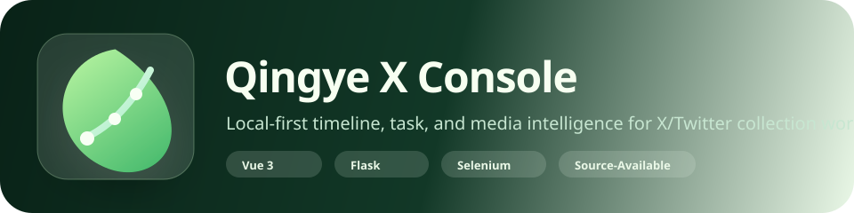
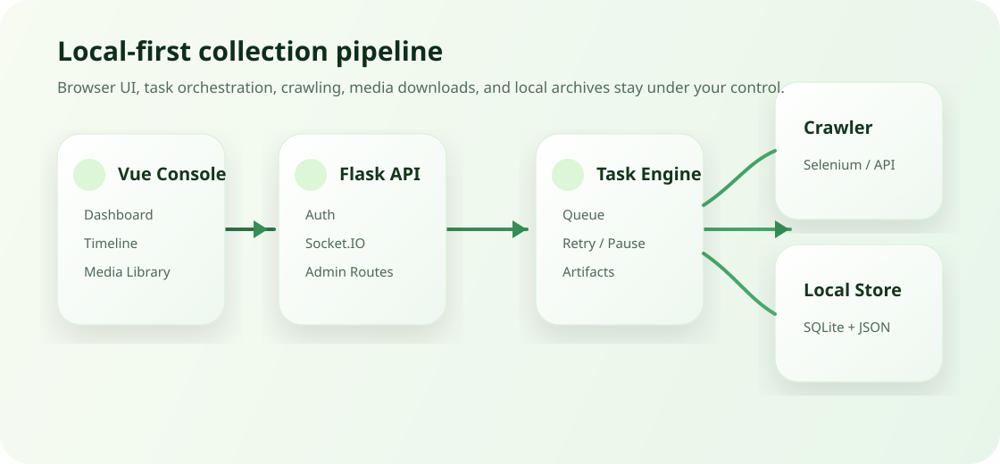

<p align="center">
  
</p>

<p align="center">
  <a href="./README.en.md">English</a>
  ·
  <a href="./README.zh-CN.md">简体中文</a>
</p>

<p align="center">
  
  
  
  
</p>

<p align="center">
  <strong>Local-first X/Twitter collection console for crawl tasks, user timelines, media archives, and review workflows.</strong>
</p>

<p align="center">
  <strong>本地优先的 X/Twitter 采集控制台：管理爬取任务、用户时间流、媒体资料库与内容复核流程。</strong>
</p>

<p align="center">
  
</p>

## Overview

Qingye X Console combines a Vue 3 admin interface with a Flask backend, Selenium-based crawling, task orchestration, local media downloads, and SQLite/JSON storage.

青野 X Console 将 Vue 3 后台界面、Flask 后端、Selenium 采集、任务队列、本地媒体下载与 SQLite/JSON 存储整合在一起，适合本地化管理账号内容与媒体资料。

## Why It Exists

- Keep crawl data, cookies, task history, and media files under local control.
- Create and monitor focused crawl tasks instead of running one-off scripts.
- Browse collected accounts by latest collection time.
- Review posts, images, and videos in a standalone timeline experience.
- Keep commercial rights protected through a source-available license.

- 采集数据、Cookie、任务历史和媒体文件默认留在本机。
- 用后台任务流管理采集，而不是散落的脚本。
- 用户时间流按最近采集时间排序，方便继续查看最新账号。
- 贴文、图片、视频都有独立浏览体验。
- 采用 source-available 授权，保留商业授权权利。

## Visual Architecture

<p align="center">
  
</p>

## Quick Start

```bash
python3 -m venv .venv
source .venv/bin/activate
pip install -r requirements.txt

cp .env.example .env

cd frontend
npm install
npm run build
cd ..

python3 app.py
```

Open:

```text
http://localhost:5001
```

Default admin login:

```text
username: admin
password: admin123
```

Change the password after first login.

## Documentation

- [English README](./README.en.md)
- [中文说明文档](./README.zh-CN.md)
- [Commercial License Notes](./COMMERCIAL_LICENSE.md)
- [License](./LICENSE)

## Commercial Licensing

This project is **source-available**, not MIT/Apache/GPL open source.

Commercial use, SaaS use, resale, paid hosting, white-label distribution, or integration into paid products requires a separate written commercial license.

本项目是 **source-available**，不是 MIT/Apache/GPL 开源授权。

商业使用、SaaS、转售、付费托管、白标分发或集成进付费产品，都需要获得单独的书面商业授权。

## Privacy Notice

This public repository intentionally excludes private crawl data, cookies, local databases, task history, output files, and real collected media.

这个公开仓库不会包含真实采集数据、Cookie、本地数据库、任务历史、输出文件或真实媒体资料。
